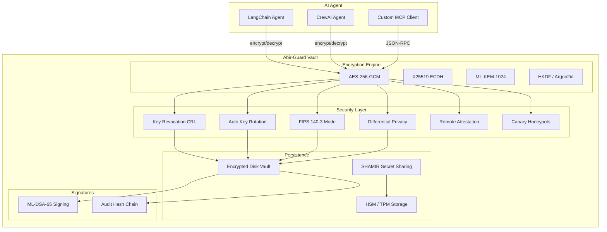

# Abir-Guard v3.1.0 — Quantum-Resilient Agentic Vault for AI Agent Memory

<p align="center">
  <strong>Protect AI agent secrets, API keys, and memory with NIST-standard post-quantum cryptography.</strong>
</p>

<p align="center">
  
  
  
  
  
  
  
</p>

<p align="center">
  
  
  
  
  
</p>

<p align="center">
  
  
  
  
</p>

<p align="center">
  
  
  
</p>

---

```diff
- Legacy memory storage is a ticking time bomb.
+ Abir-Guard: The Quantum-Resilient "Black Box" for Autonomous Agent Memory.
```

---

## At a Glance

| Category | Highlights |
|---|---|
| **Quantum-Safe** | ML-KEM-1024 (production-ready), ML-DSA-65, X25519 hybrid KEM, AES-256-GCM envelope encryption |
| **Multi-Language** | Python SDK, Rust CLI + Library, Go SDK, JavaScript SDK |
| **AI Native** | LangChain tools, CrewAI agents, MCP JSON-RPC server, HTTP MCP API |
| **Hardened** | FIPS 140-3 mode, key revocation (CRL), auto rotation, remote attestation, differential privacy, canary honeypots, tamper-evident audit logs |
| **Hardware Ready** | YubiKey/FIDO2, TPM 2.0 seal/unseal, Apple Secure Enclave, Intel SGX detection, HSM integration, zero-copy memory policy, Argon2id KDF (OWASP params) |
| **Tested** | 109 unit tests pass across all languages, CI/CD pipeline, dependabot |

---

## System Architecture



---

## Table of Contents

- [Overview](#overview)
- [Use Cases](#use-cases)
- [Prerequisites & Installation](#prerequisites--installation)
- [Quick Start](#quick-start)
- [Python SDK Guide](#python-sdk-guide)
- [Rust CLI & Library Guide](#rust-cli--library-guide)
- [Go SDK Guide](#go-sdk-guide)
- [JavaScript SDK Guide](#javascript-sdk-guide)
- [MCP Server Guide](#mcp-server-guide)
- [LangChain & CrewAI Integration](#langchain--crewai-integration)
- [Docker Deployment](#docker-deployment)
- [HSM & TPM Integration](#hsm--tpm-integration)
- [Quantum Readiness](#quantum-readiness)
- [Security Architecture](#security-architecture)
- [Run Tests](#run-tests)
- [Project Structure](#project-structure)
- [Roadmap](#roadmap)
- [Contributing](#contributing)
- [License](#license)
- [Developer](#developer)

---

## Overview

Abir-Guard is a production-grade, quantum-resistant encryption vault built for AI agent memory and sensitive data protection. It implements NIST-standard Post-Quantum Cryptography (PQC) to defend against **Harvest Now, Decrypt Later (HNDL)** attacks — where adversaries collect encrypted data today to decrypt once quantum computers become powerful enough.

**Three-phase implementation:**
1. **Bedrock** — Hybrid KEM, AES-256-GCM, zero-copy memory, MCP server, LangChain/CrewAI SDKs
2. **Hardware & Security** — ML-DSA-65 signatures, SHAMIR secret sharing, Argon2id KDF, HSM/TPM
3. **Ecosystem & Hardening** — Key revocation (CRL), auto rotation, FIPS 140-3 mode, differential privacy, remote attestation, Go SDK

**Written in three languages** for maximum portability: Python for AI agent integration, Rust for high-performance cryptography, Go for infrastructure tooling, and JavaScript for browser and Node.js environments.

---

## Use Cases

### 1. Protecting AI Agent API Keys
AI agents frequently handle API keys, OAuth tokens, and service credentials. Abir-Guard encrypts these at rest and in memory, ensuring no raw secrets leak through memory dumps, swap files, or process inspection.

```python
vault.store("gpt_agent", b"OPENAI_API_KEY=sk-...")
```

### 2. Secure Agent-to-Agent Communication
Use the MCP JSON-RPC server as a local encryption gateway. Agents send plaintext to the server; encryption happens locally without exposing data to LLM context or consuming tokens.

### 3. Regulatory Compliance (FIPS 140-3)
Enable strict FIPS mode to enforce NIST-approved algorithms only, block non-compliant fallbacks, enforce minimum key lengths, and maintain audit trails for compliance audits.

```python
from abir_guard.fips_mode import FIPSEncryptor
fips = FIPSEncryptor()
result = fips.encrypt(data, key)
```

### 4. Multi-Party Key Recovery (SHAMIR)
Split master secrets across trusted parties. A 3-of-5 SHAMIR scheme means any three administrators can reconstruct the master key, but fewer than three learn nothing.

```bash
./target/release/abir-guard shamir-split "master-key" -t 3 -n 5
```

### 5. Breach Detection via Canary Keys
Plant honeypot keys that alert when accessed. If an attacker compromises the vault and uses a canary key, you know immediately.

```python
canary_id = vault.add_canary()
if vault.check_canary():
    alert_security_team("Breach detected!")
```

### 6. Automatic Key Lifecycle Management
Configure time-based or usage-based key rotation. Keys automatically expire after N operations or N hours, reducing the window of exposure from compromised keys.

```python
rotation_manager.register_key("agent-1", max_operations=1000)
```

### 7. Remote Attestation for Decryption Gates
Before decrypting sensitive data, verify the runtime environment is untampered — checking binary integrity, environment variables, and memory canaries.

```python
from abir_guard.attestation import AttestationVerifier
verifier = AttestationVerifier()
proof = IntegrityProof()
proof.compute(challenge)
if not verifier.verify_proof(proof.to_dict()):
    raise Exception("Runtime integrity check failed")
```

### 8. Post-Quantum Digital Signatures (ML-DSA-65)
Sign and verify data integrity using NIST FIPS 204 ML-DSA-65 — post-quantum secure, tamper-evident, non-repudiation guarantees.

```rust
let keypair = ml_dsa::generate_keypair().unwrap();
let signature = ml_dsa::sign(b"agent-memory", &keypair.signing_key).unwrap();
```

---

## Prerequisites & Installation

### System Requirements

| Component | Minimum | Recommended |
|---|---|---|
| OS | Linux, macOS, Windows | Ubuntu 22.04+, macOS 13+, Windows 11 |
| CPU | x86_64, ARM64 | Any modern multi-core |
| RAM | 128 MB | 256 MB+ (Argon2id uses 64 MB) |
| Disk | 50 MB | 100 MB |

### Python SDK

```bash
# Prerequisites: Python 3.10+
python3 --version  # Must be 3.10 or higher

# Install package and dev dependencies
pip install -e ".[dev]"

# Optional: LangChain/CrewAI integration
pip install crewai langchain-core
```

### Rust CLI + Library

```bash
# Prerequisites: Rust 1.70+ via rustup
curl --proto '=https' --tlsv1.2 -sSf https://sh.rustup.rs | sh
source "$HOME/.cargo/env"
rustc --version  # Must be 1.70 or higher

# Build release binary
cargo build --release

# Install as CLI tool
cargo install --path .
```

### Go SDK

```bash
# Prerequisites: Go 1.21+
# macOS: brew install go
# Linux: sudo apt install golang-go
# Windows: download from https://go.dev/dl/

go version  # Must be 1.21 or higher

# Download module dependencies
cd sdk/go && go mod tidy

# Run tests
go test -v
```

### JavaScript SDK

```bash
# Prerequisites: Node.js 18+
node --version  # Must be 18 or higher

# SDK is built-in — no npm install needed
# Usage: const { AbirGuard } = require('./src/abir_guard');
```

### Docker

```bash
# Prerequisites: Docker Engine 20.10+
docker --version

# Build and run
docker build -t abir-guard:latest .
docker run -d -p 9090:9090 -e ABIR_GUARD_API_KEY="your-key" abir-guard:latest
```

---

## Quick Start

### Install from Package Managers (Recommended)

```bash
# Python (PyPI)
pip install abir-guard

# Rust (crates.io)
cargo add abir_guard

# Go (GitHub)
go get github.com/Abiress/abir-guard/sdk/go
```

### From Source

```bash
# Clone and install all components
git clone https://github.com/Abiress/abir-guard.git
cd abir-guard

# Python: install and test
pip install -e ".[dev]"
python3 tests/run_tests.py

# Rust: build and test
cargo build --release && cargo test

# Go: test
cd sdk/go && go test -v && cd ../..

# JavaScript: verify (Node.js)
node -e "const { AbirGuard } = require('./src/abir_guard'); new AbirGuard().generateKeyPair('test').then(console.log)"
```

---

## Python SDK Guide

### Basic Vault Operations

```python
from abir_guard import Vault

vault = Vault()

# Generate keypair for an agent
pub, sec = vault.generate_keypair("finance_agent")

# Encrypt sensitive data
ct = vault.store("finance_agent", b"API_KEY=sk-abc123xyz")

# Decrypt data
plaintext = vault.retrieve("finance_agent", ct)
# → b"API_KEY=sk-abc123xyz"

# Auto-generate keys on first use
ct = vault.store("new_agent", b"data")  # keypair created automatically

# List and delete keys
vault.list_keypairs()        # ['finance_agent', 'new_agent']
vault.remove_keypair("new_agent")
```

### Phase 3 Features

```python
# Key Revocation (CRL)
from abir_guard.revocation import RevocationList, RevocationReason
crl = RevocationList()
crl.revoke("compromised-key", RevocationReason.COMPROMISED, "admin", "Key leaked")
crl.is_revoked("compromised-key")  # True

# Automatic Key Rotation
from abir_guard.rotation import KeyRotationManager
mgr = KeyRotationManager(default_max_operations=1000)
mgr.register_key("agent-1", max_operations=500)
mgr.record_usage("agent-1", "encrypt")
mgr.needs_rotation("agent-1")  # False (under limit)

# FIPS 140-3 Compliance Mode
from abir_guard.fips_mode import FIPSEncryptor
fips = FIPSEncryptor()
encrypted = fips.encrypt(data, key)
decrypted = fips.decrypt(ct, tag, nonce, key)

# Differential Privacy Entropy
from abir_guard.differential_privacy import DifferentialEntropyCollector
collector = DifferentialEntropyCollector(epsilon=0.5, sample_count=20)
entropy = collector.collect()  # 32 bytes of noise-injected entropy

# Remote Attestation
from abir_guard.attestation import IntegrityProof, AttestationVerifier
proof = IntegrityProof()
proof.compute(challenge="abc123")
verifier = AttestationVerifier()
verifier.verify_proof(proof.to_dict())  # True if untampered
```

### MCP HTTP Server

```python
from abir_guard.mcp_http import McpHttpServer

server = McpHttpServer(port=9090, api_key="your-secret-key", rate_limit=100)
server.start()

# curl http://localhost:9090/health
# curl -X POST http://localhost:9090 -H "Authorization: Bearer your-secret-key" ...
```

---

## Rust CLI & Library Guide

### CLI Commands

```bash
# Initialize vault with passphrase
./target/release/abir-guard -k "my-passphrase" init my-agent

# Encrypt / decrypt
./target/release/abir-guard -k "my-passphrase" encrypt my-agent "secret data"
./target/release/abir-guard -k "my-passphrase" decrypt my-agent "<ciphertext>" "<nonce>"

# SHAMIR secret sharing
./target/release/abir-guard shamir-split "my-passphrase" -t 3 -n 5
./target/release/abir-guard shamir-join "1:..." "3:..." "5:..."

# ML-DSA signatures
./target/release/abir-guard -k "my-passphrase" mldsa-init --key-id agent
./target/release/abir-guard -k "my-passphrase" mldsa-sign agent "data"

# Start MCP server
./target/release/abir-guard mcp-server --mode stdio
```

### Library Usage

```rust
use abir_guard::Vault;

let vault = Vault::new();
let ct = vault.store(b"agent-1", b"secret data").unwrap();
let plain = vault.retrieve(b"agent-1", &ct).unwrap();
assert_eq!(plain, b"secret data");
```

Persistent vault with passphrase:

```rust
use abir_guard::persistent_vault;

let vault = persistent_vault::get_vault("my-passphrase");
let ct = persistent_vault::store_encrypted(&vault, "agent", b"secret", "my-passphrase").unwrap();
```

---

## Go SDK Guide

```go
import "github.com/abir-guard/abir-guard/sdk/go"

vault := abirguard.NewVault()

// Generate keypair
vault.GenerateKeypair("agent-1")

// Encrypt / decrypt
ct, _ := vault.Encrypt("agent-1", []byte("sensitive data"))
plain, _ := vault.Decrypt("agent-1", ct)

// Revoke key
vault.RevokeKey("compromised", "compromised", "admin", "Key leaked")

// Rotate key
vault.RotateKey("agent-1")

// Check rotation status
meta, _ := vault.GetMetadata("agent-1")
fmt.Printf("Operations: %d encrypt, %d decrypt\n", meta.EncryptCount, meta.DecryptCount)

// Audit log
for _, entry := range vault.GetAuditLog() {
    fmt.Printf("[%s] %s: %s\n", entry.Timestamp, entry.Action, entry.KeyID)
}
```

---

## JavaScript SDK Guide

```javascript
const { AbirGuard, AbirGuardMCP } = require('./src/abir_guard');

const vault = new AbirGuard();

const { publicKey, secretKey } = await vault.generateKeyPair('agent-1');
const { ciphertext, nonce, authTag } = await vault.encrypt('agent-1', 'API_KEY=sk-...');
const plaintext = await vault.decrypt('agent-1', { ciphertext, nonce, authTag });

// Rotate key (kill switch)
await vault.rotateKey('agent-1');

// MCP client
const mcp = new AbirGuardMCP(9090);
const result = await mcp.encrypt('agent-1', 'secret data');
```

---

## MCP Server Guide

### JSON-RPC Methods

| Method | Params | Response | Description |
|--------|--------|----------|-------------|
| `generate_key` | `{key_id}` | `{key_id, generated: true}` | Create keypair |
| `encrypt` | `{key_id, data}` | `{nonce, ciphertext, key_id}` | Encrypt data |
| `decrypt` | `{key_id, ciphertext}` | `{plaintext}` | Decrypt data |
| `list_keys` | `{}` | `{keys: [...]}` | List active keys |
| `delete_key` | `{key_id}` | `{deleted: true}` | Remove keypair |
| `add_canary` | `{}` | `{canary_id}` | Plant honeypot key |
| `check_canary` | `{}` | `{breach_detected: bool}` | Check for breaches |
| `audit_log` | `{limit}` | `{entries: [...]}` | View audit log |
| `clear_cache` | `{}` | `{cleared: true}` | Clear memory cache |
| `info` | `{}` | `{name, version, mcp_version}` | Server info |

### HTTP Endpoints

| Endpoint | Auth | Description |
|----------|------|-------------|
| `POST /` | Bearer token | MCP JSON-RPC gateway |
| `GET /health` | Public | Health check |
| `GET /audit` | Bearer token | Last 100 audit entries |

---

## LangChain & CrewAI Integration

### LangChain

```python
from abir_guard.langchain import get_langchain_tools

tools = get_langchain_tools()
# [SilentQKeyGenTool, SilentQEncryptTool, SilentQDecryptTool]
```

### CrewAI

```python
from abir_guard.crewai import get_crewai_tools

tools = get_crewai_tools()
# [KeyGenCrewTool, EncryptCrewTool, DecryptCrewTool]
```

---

## Docker Deployment

```bash
# Build image
docker build -t abir-guard:latest .

# Run with API key and persistent volume
docker run -d --name abir-guard \
  -p 9090:9090 \
  -e ABIR_GUARD_API_KEY="your-secret-key" \
  -v abir-keys:/root/.abir_guard \
  abir-guard:latest

# Health check
curl http://localhost:9090/health

# Encrypt via HTTP
curl -X POST http://localhost:9090 \
  -H "Authorization: Bearer your-secret-key" \
  -H "Content-Type: application/json" \
  -d '{"jsonrpc":"2.0","id":1,"method":"encrypt","params":{"key_id":"agent","data":"secret"}}'
```

---

## HSM & TPM Integration

```python
from abir_guard.abir_hsm import HSMKeyStore, TPMKeyStore

# Auto-detect best backend per OS
hsm = HSMKeyStore()
# macOS → Keychain, Windows → Credential Manager, Linux → file/secret_service

hsm.store_secret("my-api-key", b"sk-abc123")
secret = hsm.retrieve_secret("my-api-key")

# TPM 2.0 hardware detection
tpm = TPMKeyStore()
if tpm.is_available():
    print("TPM hardware detected — keys can be hardware-sealed")
```

## Phase 2 Hardware Security Features

### YubiKey / FIDO2 Integration

```python
from abir_guard import YubiKeyManager

yk = YubiKeyManager()

# Generate hardware-backed key
cred_id = yk.generate_key("agent-1", "ed25519")

# Sign data (requires YubiKey touch in production)
signature = yk.sign("agent-1", b"data to sign")

# Encrypt/decrypt with YubiKey-backed keys
ct, nonce = yk.encrypt_with_yubikey("agent-1", b"secret")
plaintext = yk.decrypt_with_yubikey("agent-1", ct, nonce)
```

### TPM 2.0 Seal/Unseal

```python
from abir_guard import TPM2Sealer

tpm = TPM2Sealer()

# Seal data to TPM PCR values (hardware-bound)
sealed = tpm.seal(b"master-key", pcr_indices=[0, 7])

# Unseal - only works if system state matches
recovered = tpm.unseal(sealed)
```

### Hardware Enclave Detection

```python
from abir_guard import HardwareEnclave

enc = HardwareEnclave()
print(f"Platform: {enc.platform}")
print(f"Available: {enc.is_available()}")

# Generate hardware-backed key
enc.generate_key("agent-1")

# Seal/unseal using best available hardware
sealed = enc.seal(b"secret", "agent-1")
recovered = enc.unseal(sealed, "agent-1")

# Get attestation report
report = enc.attest(b"challenge-nonce")
```

---

## Quantum Readiness

### What "Quantum-Ready" Means for Abir-Guard

| Threat | Mitigation | Status |
|---|---|---|
| **Harvest Now, Decrypt Later** | ML-KEM-1024 key encapsulation (NIST FIPS 203) | Production Ready |
| **Quantum Key Extraction** | AES-256-GCM with 256-bit keys (Grover-resistant) | Production |
| **Signature Forgery (Shor's)** | ML-DSA-65 digital signatures (NIST FIPS 204) | Production |
| **Side-Channel Quantum Attacks** | Differential privacy entropy + constant-time comparison | Production |
| **Memory Scraping** | Zero-copy memory policy + explicit key zeroization | Production |
| **Future Quantum Break** | Hybrid KEM (ML-KEM + X25519) — both must break | Production |

### Current Quantum Status

- **AES-256-GCM**: Quantum-safe. Grover's algorithm reduces effective strength to 128-bit, still secure.
- **ML-DSA-65**: Post-quantum signatures deployed and tested. 3309-byte signatures, constant-time operations.
- **ML-KEM-1024**: Production-ready. Implemented in Python via `pqcrypto` (PQClean-backed) and Rust via `ml-kem` crate (pure Rust). Full keygen, encapsulation, and decapsulation roundtrip verified.
- **SHAMIR + Argon2id**: Classical but quantum-safe for their use cases (threshold sharing, key derivation).

### Mission Alignment 🇮🇳🌍

This project aligns with and supports:

- **🇮🇳 Indian Quantum Mission** — India's National Quantum Mission (NQM) aims to develop quantum technologies for communication, computing, and sensing. Abir-Guard provides NIST-standard post-quantum cryptography to safeguard India's quantum infrastructure against Harvest Now, Decrypt Later threats.
- **🌍 Global Quantum Mission** — Aligns with the worldwide transition to post-quantum cryptography as mandated by NIST, ENISA, and national cybersecurity agencies. Abir-Guard implements NIST FIPS 203 (ML-KEM) and FIPS 204 (ML-DSA) for quantum-resilient data protection.
- **🇮🇳🌍 Indian AI Mission** — Supports India's AI sovereignty initiative by providing quantum-secure memory vaults for AI agents, ensuring API keys, model weights, and agent memory remain protected against future quantum attacks. Built in India, for the world.

### After Quantum Breakthrough

1. All ML-KEM-1024 backends are production-ready — no additional setup needed
2. Python uses `pqcrypto` (PQClean-backed) for native ML-KEM-1024
3. Rust uses `ml-kem` crate (pure Rust, zero dependencies)
4. Existing hybrid keys remain valid during transition

---

## Security Architecture

### Hybrid KEM Design

```
┌──────────────────────────────────────────────────────────┐
│              Hybrid Key Encapsulation                     │
│  ML-KEM-1024 (PQC)  +  X25519 (Classical ECDH)          │
│  Security: Both must be broken to compromise              │
└──────────────────────────────────────────────────────────┘
                          │
                          ▼
┌──────────────────────────────────────────────────────────┐
│              Envelope Encryption                         │
│  AES-256-GCM (NIST FIPS 197)                            │
│  96-bit random nonce + 128-bit auth tag per message     │
└──────────────────────────────────────────────────────────┘
```

### Defense-in-Depth Layers

| Layer | Controls |
|---|---|
| **Cryptography** | AES-256-GCM, ML-KEM-1024, ML-DSA-65, Argon2id, HKDF-SHA256 |
| **Memory Safety** | Zero-copy policy, explicit key zeroization, Rust ownership model |
| **Network** | Bearer token auth, rate limiting (100/min), TLS support, localhost default |
| **Integrity** | SHA-256 hash-chain audit logs, HMAC-signed CRL, tamper-evident vault |
| **Runtime** | Remote attestation, canary honeypots, Spectre/Meltdown noise injection |
| **Lifecycle** | Auto key rotation (time/usage), revocation, expiry policies |
| **Compliance** | FIPS 140-3 strict mode, approved algorithms only, audit trail |

---

## Run Tests

```bash
# Full test suite (recommended before deployment)
cargo build --release && cargo test && \
python3 tests/run_tests.py && \
pytest tests/test_abir_guard.py tests/test_phase3.py -v && \
cd sdk/go && go test -v && cd ../..

# Individual test suites
cargo test                          # Rust: 32 tests
pytest tests/test_abir_guard.py -v  # Python Phase 1: 17 tests
pytest tests/test_phase3.py -v      # Python Phase 3: 24 tests
pytest tests/test_phase2_hardware.py -v  # Python Phase 2: 24 tests
cd sdk/go && go test -v             # Go: 12 tests
python3 tests/run_tests.py          # Manual suites: 5/5
```

**All 109 tests pass across Rust, Python, and Go.**

---

## Project Structure

```
abir_guard/
├── abir_guard/              # Python package (15 modules)
│   ├── __init__.py          # Core Vault, HybridEncryptor, McpServer, AuditLogger
│   ├── ml_kem.py            # ML-KEM-1024 + X25519 hybrid KEM (real ECDH)
│   ├── yubikey_integration.py # YubiKey/FIDO2 integration (software fallback)
│   ├── tpm2_seal.py         # TPM 2.0 seal/unseal (tpm2-tools CLI)
│   ├── hardware_enclave.py  # Apple SE, Intel SGX, AMD SEV detection
│   ├── langchain.py         # LangChain tool integration (3 tools)
│   ├── crewai.py            # CrewAI tool integration (version-compatible)
│   ├── abir_hsm.py          # HSM/TPM integration (Keychain, CredMgr, file, TPM)
│   ├── mcp_http.py          # Hardened HTTP MCP server (auth, rate limit, TLS)
│   ├── crypto_store.py      # Encrypted disk persistence (Argon2id + AES-GCM + HMAC)
│   ├── revocation.py        # CRL-style key revocation with HMAC signing
│   ├── rotation.py          # Automatic key rotation (time-based + usage-based)
│   ├── fips_mode.py         # FIPS 140-3 compliance mode (strict NIST algorithms)
│   ├── differential_privacy.py # Laplace noise entropy (Spectre/Meltdown defense)
│   └── attestation.py       # Remote attestation (runtime integrity verification)
├── src/                     # Rust source (12 modules)
│   ├── lib.rs               # Library entry point + re-exports
│   ├── main.rs              # CLI binary (clap subcommands, passphrase, validation)
│   ├── quantum_kernel.rs    # Hybrid encryption + 200ms watchdog + zeroization
│   ├── entropy_inject.rs    # CPU jitter entropy collector
│   ├── zero_copy.rs         # Zero-copy vault with LRU-encrypted cache
│   ├── mcp_gateway.rs       # MCP JSON-RPC server (10 methods)
│   ├── persistent_vault.rs  # Encrypted file persistence (Argon2id + AES-GCM + ML-DSA)
│   ├── kdf.rs               # Argon2id key derivation (OWASP: 64MB, 3 iter)
│   ├── shamir.rs            # SHAMIR Secret Sharing (t, n) over GF(251)
│   ├── ml_dsa.rs            # ML-DSA-65 signatures (NIST FIPS 204)
│   ├── revocation.rs        # Key revocation/blacklist (CRL, HMAC-signed)
│   ├── rotation.rs          # Automatic key rotation manager
│   └── differential_privacy.rs # Laplace noise + Spectre/Meltdown defender
├── sdk/
│   ├── go/                  # Go SDK (AES-256-GCM vault with CRL, rotation, metadata)
│   │   ├── abirguard.go     # Core implementation
│   │   ├── abirguard_test.go # 12 unit tests
│   │   └── go.mod           # Module definition
│   └── js/                  # JavaScript SDK (Node.js crypto + MCP client)
│       └── abir_guard.js    # Basic vault + MCP client
├── examples/                # Usage examples
├── tests/                   # Test suites (Python)
│   ├── run_tests.py         # Manual test runner (5 suites)
│   ├── test_abir_guard.py   # Pytest Phase 1 (17 tests)
│   ├── test_phase2_hardware.py # Pytest Phase 2 (24 tests)
│   └── test_phase3.py       # Pytest Phase 3 (24 tests)
├── scripts/                 # Publishing and debugging scripts
│   ├── publish-pypi.sh      # PyPI publishing script
│   ├── publish-crates.sh    # crates.io publishing script
│   └── debug.sh             # Full project debug & verification
├── Cargo.toml               # Rust dependencies (edition 2021)
├── pyproject.toml           # Python package config (v3.1.0)
├── PUBLISHING.md            # PyPI and crates.io publishing guide
├── Dockerfile               # Container build (hardened MCP server)
├── LICENSE                  # MIT License (2026)
├── README.md                # This file
├── THREAT_MODEL.md          # Zero-trust threat model
├── SECURITY.md              # Vulnerability reporting
├── CONTRIBUTING.md          # Contribution guidelines
├── CODE_OF_CONDUCT.md       # Community standards
├── CITATION.cff             # Academic citation
└── TASKS.md                 # Feature status and roadmap
```

---

## Roadmap

### Phase 1: Bedrock (Complete)
- [x] X25519 hybrid KEM with AES-256-GCM
- [x] Memory zeroization (Rust `zeroize`)
- [x] Security Watchdog (200ms)
- [x] Encrypted disk persistence
- [x] Input validation
- [x] MCP JSON-RPC Gateway
- [x] Python + Rust + JavaScript SDKs
- [x] LangChain + CrewAI integration
- [x] HSM + TPM integration
- [x] Docker + CI/CD
- [x] Audit logging + canary keys

### Phase 2: Hardware & Security (Complete)
- [x] ML-DSA-65 signatures (NIST FIPS 204)
- [x] SHAMIR secret sharing (GF(251))
- [x] Argon2id KDF in Rust
- [x] Real ML-KEM-1024 (Python: `pqcrypto` + Rust: `ml-kem` crate)
- [x] YubiKey / FIDO2 integration (software fallback ready)
- [x] TPM 2.0 seal/unseal (via tpm2-tools CLI)
- [x] Apple Secure Enclave / Intel SGX / AMD SEV platform detection

### Phase 3: Ecosystem & Hardening (Complete)
- [x] Key revocation (CRL, HMAC-signed)
- [x] Automatic key rotation (time/usage)
- [x] FIPS 140-3 compliance mode
- [x] Differential privacy entropy
- [x] Remote attestation
- [x] Go SDK
- [x] PyPI publishing (`pip install abir-guard`)
- [x] crates.io publishing (`cargo add abir_guard`)

---

## Upcoming Phases

### 🚀 Phase 4: Enterprise & Cloud Integration (Q1 2026)

*Production readiness for enterprise deployments and cloud-native workflows*

- [ ] **Real YubiKey/FIDO2 Hardware** — FIDO2/CTAP2 operations, touch confirmation, PIV slot management
- [ ] **Native TPM 2.0 API** — `tpm2-tss` library integration, PCR policy automation
- [ ] **AWS KMS / GCP KMS Integration** — Cloud KMS backends, envelope encryption
- [ ] **HashiCorp Vault Integration** — Vault transit engine backend, enterprise secret management
- [ ] **Kubernetes Operator** — Auto-inject vault sidecars, secret rotation, Helm charts
- [ ] **Multi-Tenant Support** — Organization/workspace isolation, RBAC, audit partitioning
- [ ] **Performance Benchmarking** — Async I/O, connection pooling, 10k ops/sec target
- [ ] **OpenTelemetry Integration** — Metrics, traces, distributed tracing for vault operations

### 🔐 Phase 5: Advanced AI Security & Compliance (Q2 2026)

*AI-specific security patterns, regulatory compliance, multi-agent workflows*

- [ ] **Complete JavaScript SDK** — ML-KEM-1024, ML-DSA-65, WebCrypto API, browser extensions
- [ ] **Model Weight Encryption** — Encrypt LLM weights at rest, secure fine-tuning pipelines
- [ ] **Prompt Injection Shield** — Detect/encrypt malicious prompts, prompt signature verification
- [ ] **GDPR/CCPA/HIPAA Compliance** — Data retention policies, right-to-erasure, audit exports
- [ ] **Multi-Agent Key Sharing** — Threshold encryption for agent swarms, quorum-based access
- [ ] **Secure Enclave for LLMs** — TEE-based inference (Intel TDX, AMD SEV-SNP), attested compute
- [ ] **Zero-Knowledge Proofs** — Prove encryption without revealing data, compliance audits
- [ ] **AI Red-Teaming Tools** — Automated attack simulation, breach scenario testing

### 🌐 Phase 6: Distributed & Quantum Ecosystem (Q3 2026)

*Distributed vault architecture, quantum network readiness, ecosystem expansion*

- [ ] **Federated Vault Network** — Distributed vault mesh, CRDT-based sync, conflict resolution
- [ ] **Quantum Key Distribution (QKD)** — QKD network integration, BB84 protocol support
- [ ] **Post-Quantum TLS** — Hybrid TLS 1.3 with ML-KEM-1024, secure transport layer
- [ ] **WASM Compilation** — Browser-native vault, edge computing, Deno/Cloudflare Workers
- [ ] **Apple Secure Enclave Native** — Swift bindings, native SE API, macOS/iOS SDK
- [ ] **Intel SGX Enclave** — Actual enclave creation, remote attestation, secure compute
- [ ] **Decentralized Identity (DID)** — W3C DID integration, self-sovereign identity, verifiable credentials
- [ ] **HSM Cluster** — Multi-HSM load balancing, failover, geographic distribution

## Contributing

See [CONTRIBUTING.md](CONTRIBUTING.md) for guidelines, coding standards, and the PR checklist. I welcome contributions from developers, security researchers, and AI engineers.

---

## Project Governance

| Document | Purpose |
|----------|---------|
| [THREAT_MODEL.md](THREAT_MODEL.md) | Zero-trust threat model, trust boundaries, mitigations |
| [SECURITY.md](.github/SECURITY.md) | Vulnerability reporting policy, disclosure process |
| [CONTRIBUTING.md](CONTRIBUTING.md) | Contribution guidelines, code style, PR checklist |
| [PUBLISHING.md](PUBLISHING.md) | PyPI and crates.io publishing guide |
| [CODE_OF_CONDUCT.md](CODE_OF_CONDUCT.md) | Community standards and enforcement |
| [CITATION.cff](CITATION.cff) | Academic citation for research papers |
| [TASKS.md](TASKS.md) | Feature status and roadmap |

---

## License

MIT License. See [LICENSE](LICENSE) for details.

Copyright (c) 2026 Abir Maheshwari

---

## Developer

**Abir Maheshwari**  
Founder at Artificial Quantum Dyson Intelligence, Biro Labs, Aquilldriver  
AI Engineer | Quantum Computing Researcher

### Connect
- **Email:** abhirsxn@gmail.com
- **LinkedIn:** https://in.linkedin.com/in/abirmaheshwari
- **Instagram:** [@anantraga31](https://instagram.com/anantraga31)
- **Medium:** https://office.qz.com/@abirmaheshwari

---

**Built with** Rust, Python, Go, JavaScript · **Secured by** NIST PQC, AES-256-GCM, Argon2id, ML-DSA-65, ML-KEM-1024 · **Licensed under** MIT 2026

---

### 🇮🇳🌍 Mission Support

| Mission | Badge | Description |
|---------|-------|-------------|
| 🇮🇳 Indian Quantum Mission |  | Quantum-resilient cryptography for India's National Quantum Mission |
| 🌍 Global Quantum Mission |  | NIST FIPS 203/204 compliant worldwide |
| 🇮🇳🌍 Indian AI Mission |  | Quantum-secure memory vaults for sovereign AI agents |

**🇮🇳 Made in India, for the World.**
